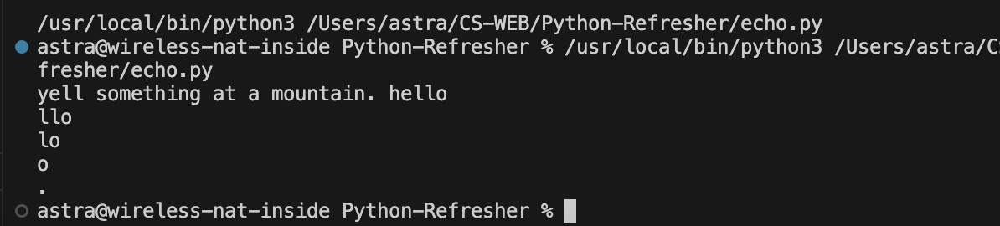
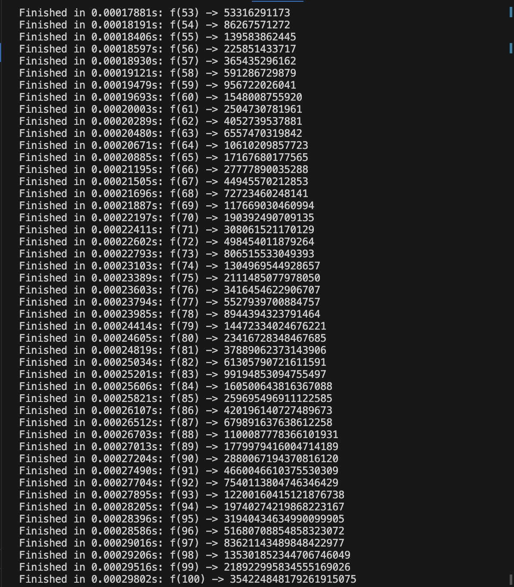

# Python-Refresher

This repository is for the first homework assingment of CS:3980 and contains two programs. The first program simulates an echo of any given length or text. The second program computes up to the Nth digit of the fibonacci sequence and the runtime required for the computation. The following images show example outputs.

This graph illistrates the runtime needed to compute the Nth digit of the fibonacci sequence. As the program is recursive it has O(2^n).
